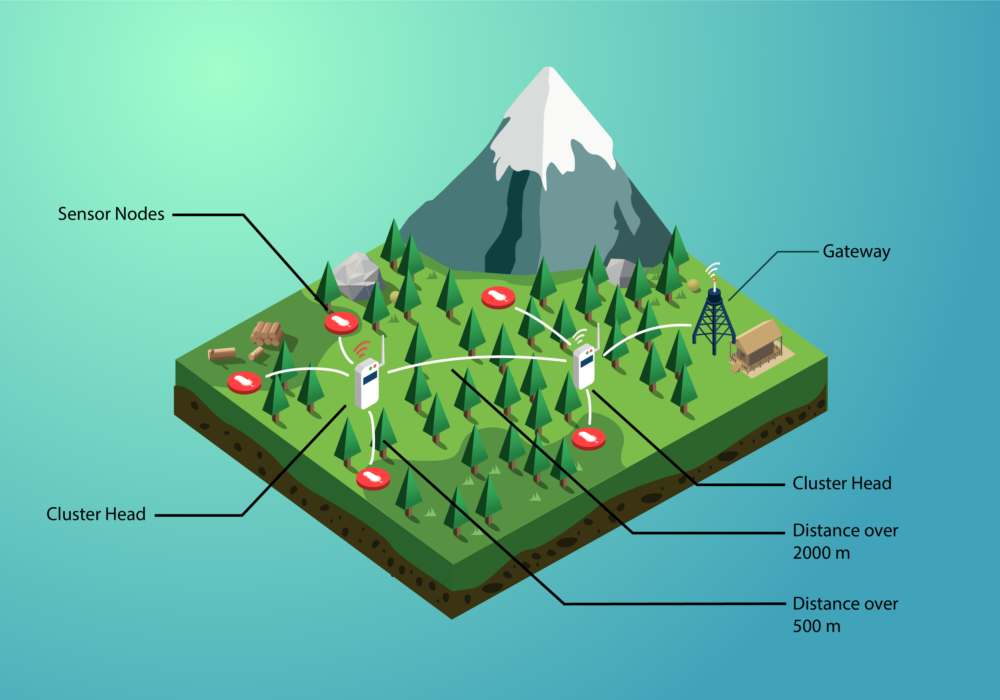
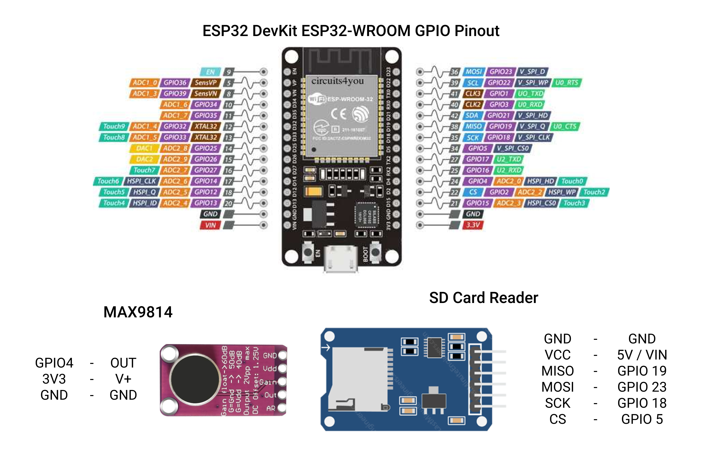

# Jagawana - IoT Device

This is a prototype code for our Sensor Network. We use ESP32 and mosquitto broker to connect with Google Cloud Platform IoT Core.

---

Jagawana is a Forest Logging Prevention System, using Wide Sensor Network and Machine Learning to detect and alert chainsaws sounds to users using Android App and Google Cloud Platform. 



---

### Another Jagawana Github Path
* [Machine Learning](https://github.com/nicorenaldo/jagawana-ml)
* [Cloud Computing](https://github.com/jeffrywu28/jagawana-cloud)
* [Mobile Apps Android](https://github.com/Bobby-Anggunawan/Jagawana-AndroidApp)

### Medium Posts
* [About Jagawana](https://nicorenaldo.medium.com/detecting-chainsaws-in-forest-with-machine-learning-jagawana-989fd345784)
* [Design and Details](https://nicorenaldo.medium.com/jagawana-internet-of-things-511d63e48349)
---
## Components
1. ESP32
2. SD Card Reader
3. Microphone

Our team use analogue microphone for the sake of prices, we use MAX9814 breakout board that includes a Microphone and Amplifier.

You can replace it with I2S device (such as the SPH0645 and INMP441) that has more support and better in general than analogue device.

## Schematics

MAX9814 Wiring

AR - dont connect

Gain - if it's not connected is 60dB Gain, if its connected to Gnd it's 50dB, and if it's connected to Vdd it's 40dB


## Workflow
The idea is for the ESP32 to record sounds and send it to a centralized gateway, the gateway then send the collected data from several nodes to Google Cloud Platform for further process.

You can use device like Raspberry Pi or even ESP32 as the gateway, but for the sake of simplicity, I use Mosquitto Broker served on my PC as the gateway.

---
# Getting Started
There are three separate parts of the project, to follow the guide, clone or download our repo first into your device.

## MQTT Broker
To allow such communication between your device (PC or Raspberry Pi) and ESP32, we are going to use a flexible lightweight communication protocol MQTT. The first requirement of MQTT is the presence of Broker that routes every messages to the appropriate subscriber. In this project we are going to use Mosquitto Broker served on PC, there are online alternatives like emqx.io but there are some downside like risk of shared topic with other people.

First off you need to install mosquitto first, you can follow the [guide](http://bytesofgigabytes.com/mqtt/installing-mqtt-broker-on-windows/) here

By default, mosquitto port doesn't open to other device other than the host. To open the device to other devices on local IP, go to the config file (default on `Program Files/mosquitto`) and edit the `mosquitto.conf` file. Add the following lines to the file and save it.
```
listener 1883 0.0.0.0
allow_anonymous true
```
This will allow other device on your local network to be able to publish messages to the broker.

## ESP32
All code for the ESP32 is on the `Arduino Code` folder. On this project we are going to use Arduino IDE to program the ESP32.

If this is your first time program an ESP32, please follow this [guide](https://randomnerdtutorials.com/installing-the-esp32-board-in-arduino-ide-windows-instructions/) first.

There are several libraries that you need to download first, you can download it from the tab `Sketch > Include Library > Manage Libraries` or follow this [guide](https://www.arduino.cc/en/Guide/Libraries) for more details

Afterward, you need to modify the code by changing the WiFi ssid and password, and include your mosquitto broker local IP, you can use ( `ipconfig` for windows, `ifconfig` for linux ) command from the command prompt and lookup the IPv4 line.

You done it, upload the code and give command to your ESP32 from your other device (PC or Raspberry Pi).

To change the maximum buffer on MQTT, you need to change the library file located on `Documents > Arduino > libraries > PubSubClient > src > PubSubClient.h`

Open and edit the file to the following lines
```
#define MQTT_MAX_PACKET_SIZE 1024
```
The default number of MQTT max packet size is 256 bytes, for this project I use 512 bytes per packet, but I define the maximum value to 1024 just to be sure.

## Gateway
First up, open the `Broker Code` folder and install some packages needed. Make sure you have Python installed, it's also recommended to make a virtual enviroment first for this project. 

Run `pip install virtualenv` to install the package, and run `python -m virtualenv venvname` to create the virtual enviroment, you can change the venvname to anything of your choice. You can activate the virtual enviroment by calling `venvname\Scripts\activate` on your command prompt.
More about virtual enviroment [here](https://uoa-eresearch.github.io/eresearch-cookbook/recipe/2014/11/26/python-virtual-env/).

Install the packages needed by running the following codes on the `Broker Code` folder.
```
pip install -r rqeuirements.txt
``` 

Before running the code, open up the `config.py` file and change the `mqttHost` value to your broker local ip address. Afterward run the `main.py` which contains the code for the gateway.

To send a message to the ESP32, just run the following codes to either record a 10 second audio, or to send it to the gateway.
```
python3 record.py
python3 send.py
```

## Contributing
If you have any suggestions or needed help, you can email me at nicorenald@gmail.com

---
## References

[C++ code for I2S sampling](https://github.com/atomic14/esp32_audio)

[I2S Micropython alternative](https://github.com/miketeachman/micropython-esp32-i2s-examples)

[C++ code for analogue microphone](https://github.com/MhageGH/esp32_SoundRecorder/)


